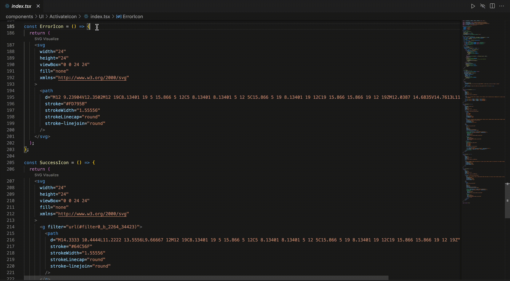

# svg-visualizer

This is an SVG visualization plugin that automatically detects SVG code and displays a "Svg Visualize" button at the top.

You can right-click on the specified directory and select [open in svg gallery], which will detect all SVG code in the directory and display it. Click the preview icon to quickly jump to the corresponding code location.

